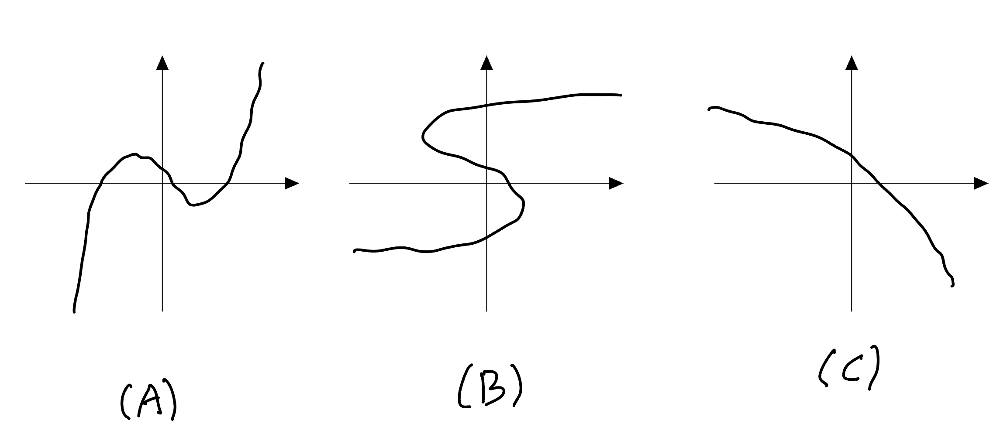

<!--@include: ../notation.md-->

# Domande di comprensione - Settimana 2

## Domanda

Si consideri le seguenti relazioni fra tre quantità $A,B,C$:

$$
\begin{array}{|c|c|c|}
A & B & C 
\\
\hline 
1 & 1 & 6
\\
1 & 2 & 5
\\
2 & 3 & 4
\\
2 & 4 & 3
\\
3 & 5 & 2
\\
3 & 6 & 1
\\
\end{array}
$$
Quali di queste sono funzioni di quali altre?

::: details
$A$ è funzione sia di $B$ sia di $C$ (ma non viceversa); 
$B$ è funzione di $C$ e anche viceversa.
:::

## Domanda

Quale di queste figure 

1. è il grafico di una funzione invertibile,
2. è il grafico di una funzione non invertibile,
3. non è il grafico di una funzione?

::: details

1C, 2A, 3B

:::

## Domanda

Siano $f(x) = x^2$,  $g(x) = x^2 - 2$, $h(x) = x - 2$.  Quale delle seguenti è vero?

1. $h = f \circ g$
2. $g = h \circ f$
3. $g = f \circ h$

::: details

$\boxed{g = h \circ f}$; cioè, $g$ corrisponde a prima prendere il quadrato ($f$) e poi sottrare due ($h$).

:::
