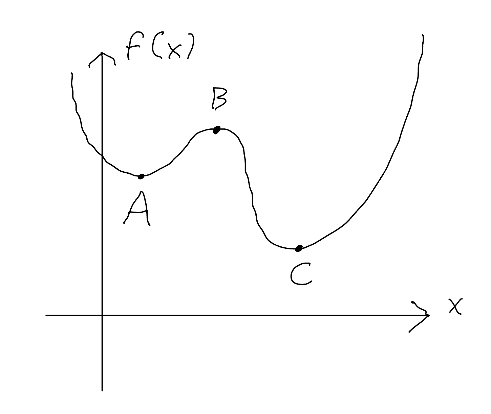

<!--@include: ../notation.md-->

# Domande di comprensione - Settimana 7

## Domanda

Riferendo al grafico di sotto, quale dei punti è/sono

1. Un massimo assoluto,
2. un massimo relativo,
3. un minimo relativo,
4. un minimo assoluto

della funzione $f(x)$?

::: details

1. Nessuno,
2. B,
3. sia A sia C,
4. C.

:::
