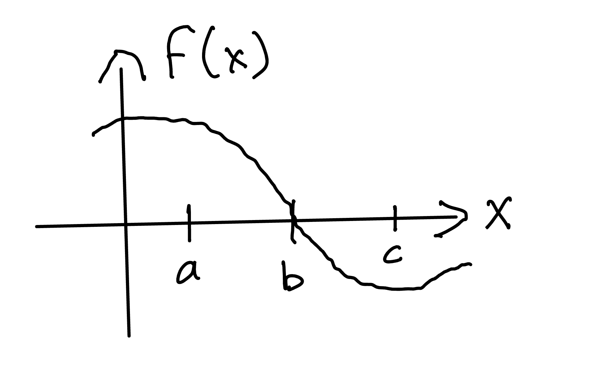

<!--@include: ../notation.md-->

# Domande di comprensione - Settimana 9

## Domanda

Riferendo al grafico di sotto, quale dell seguenti affermezioni sono vere/false?

1. $$ \int_b^a f(x) d x > 0 $$
2. $$ \int_b^c f(x) d x > 0 $$
3. $$ \int_a^b f(x) d x > \int_a^c f(x) dx $$

::: details

1. Falso
2. Falso
3. Vero

:::

## Domanda

Supponiamo che $\int_0^4 f(x) d x = 5$, $\int_0^2 f(x) d x = -3$, $\int_0^4 g(x) dx = -1$ e $\int_0^2 g(x) dx = 2$.  Allora quanto valgono i seguenti altri integrali definiti?

1. $$ \int_0^4 [f(x)+g(x)] dx$$
2. $$ \int_2^4 f(y) d y $$
3. $$ \int_2^4 [f(x) + g(x)] d x $$
4. $$ \int_0^2 [f(y) - g(y)] d y$$

::: details
1. $4$
2. $8$
3. $5$
4. $-5$
:::
