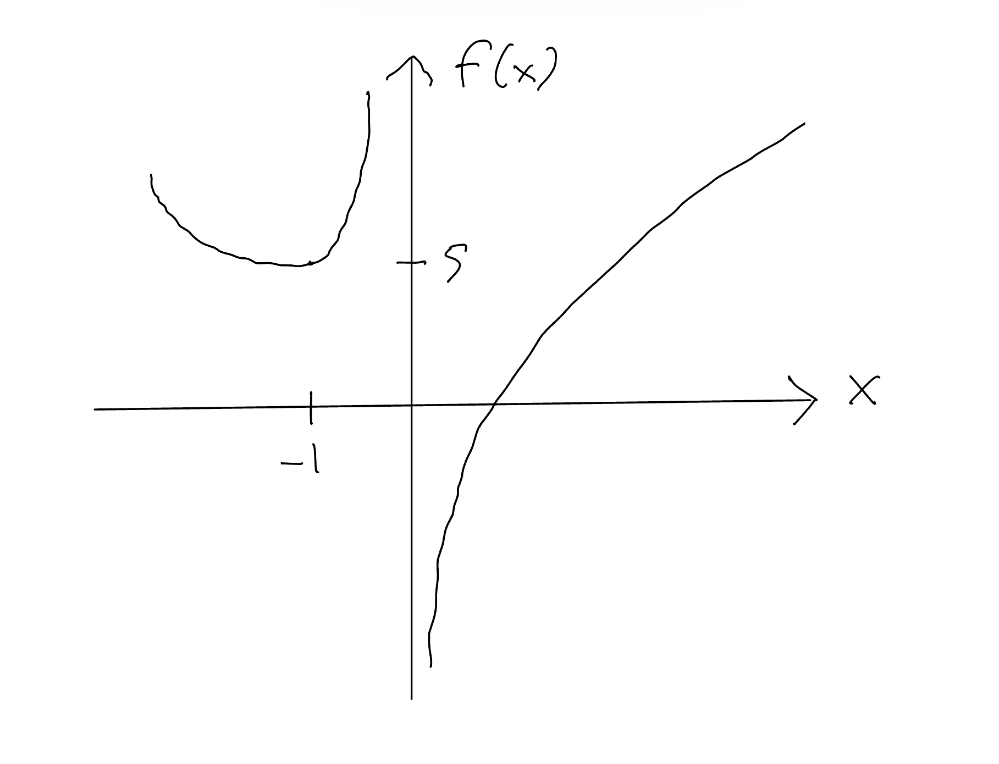
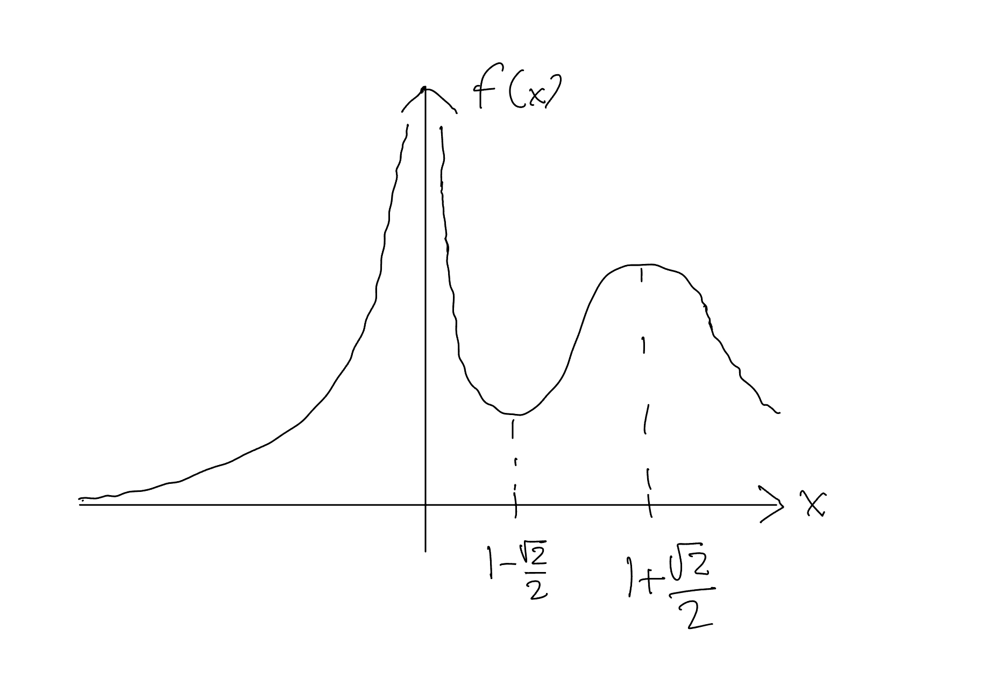

<!--@include: ../notation.md-->

# Esercizi - Settimana 8

## Esercizio

Si trovino le eventuali estremi (massimi/minimi) delle funzioni seguenti, dicendo se sono estremi globali o locali.

a. $f(x) = x^4 - 4 x^3 - 8 x^2 +5$
b. $g(x) = x^6 - 3 x^4$

::: details
a. Notando che $f'(x) = 4x^3 - 12 x^2 -16 x = 4 x (x^2 - 3x -4)$, $f$ è sempre derivabile ed ha punti stazionari $x =-1,0,4$.
Poi $f''(x) = 12 x^2 - 24 x - 16$; quindi 
$$
f''(-1) = 20 > 0
, \quad
f''(0) = -16 < 0
, \quad
f''(4) = 80 >0
$$
allora $-1$ e $-4$ sono minimi locali di $f$ e $0$ è un massimo locale.
Per stabilire quali sono anche estremi *globali*, prima nota che
$$
\lim_{x \to \pm \infty} f(x) = +\infty,
$$
allora $f$ non ha nessun massimo locale.  Per quanto riguarda i minimi, valutiamo
$$
f(-1) =  -5
, \quad
f(4) = -130;
$$
quindi $4$ è un minimo *globale*, $-1$ no.  Riassumendo,
$$
\boxed{\textup{Massimo locale in }0; \textup{ minimo locale in }-1; \textup{ minimo globale in } 4}.
$$
(strettamente parlando anche $4$ è anche un minimo locale ma va bene lasciare intendere questo).
b. Essendo $g'(x) = 6 x^5 - 12 x^3 = 6 x^3 (x^2-2)$, $g$ ha punti stazionari in $x=-\sqrt 2,0,\sqrt 2$.
Il segno di $g'$ cambia così:
$$
\begin{array} {c|c|c|c|c}
x & (-\infty,-\sqrt 2) & (-\sqrt 2,0) & (0,\sqrt 2) & (\sqrt 2,\infty)
\\
\hline
g'(x) & - & + & - & +
\end{array}
$$
e allora $-\sqrt 2,\sqrt 2$ sono minimi locali e $0$ è un massimo locale (nonostante che $g''(0) = 0$).  Allora notando anche che $\lim_{\pm \infty} g(x) = \infty$ e $g(-\sqrt2) = g(\sqrt2) =-4$:
$$
\boxed{\textup{Massimo locale in }0; \textup{ minimi globali in } -\sqrt2, \sqrt2}.
$$
:::

## Esercizio

Sia 
$$
f(x)= \frac{x^3 + 2x-2}{x}
.
$$

a. Qual'è il dominio di $f$?
b. Che sono i limiti di $f$ agli estremi degli intervalli in cui è definito?
c. Quali sono i estremi di $f$?  Per ognuno, specifica di quale tipo si tratta (massimo/minimo, locale/globale) e il valore associato di $f$.
d. Tracciare il grafico di $f$.

::: details
a. $f$ è definito per ogni $x$ tranne $0$, ovvero il suo dominio è $\boxed{(-\infty,0) \cup (0,\infty)}$. 
b. $$ \lim_{x \to \pm \infty} f(x) = \lim_{x \to \pm \infty} x^2 = \boxed{\pm \infty};$$
poi visto che il denominatore di $f(x)$ vale $-2$ in $x=0$,
$$ 
\lim_{x \to 0^-} f(x) 
=
\lim_{x \to 0^-} \frac{-2}{x} = \boxed{\infty}
, \quad 
\lim_{x \to 0^+} f(x) 
=
\lim_{x \to 0^+} \frac{-2}{x} = \boxed{- \infty}
$$
c. $$ f'(x) = \frac{(3 x^2+2)x - x^3+2x-2}{x^2} = \frac{2 x^3 +2}{x^2},$$
allora c'è un unico punto stazionario in $x=-1$, e nessun punto di non-derivabilità nel dominio.  Evidentemente $f'(x) < 0$ se $x < -1$ e $f'(x) >0$ se $x \in (-1,0)$, allora $f$ ha
$$
\boxed{\textup{un minimo locale in } x = -1, \ f(-1) = 5}
$$
(visto i limiti, è necessariamente solo un minimo locale).
d. 

:::

## Esercizio

Sia 
$$
f(x)= \frac{e^{-(x-2)^2}}{|x|}
.
$$

a. Qual'è il dominio di $f$?
b. Che sono i limiti di $f$ agli estremi degli intervalli in cui è definito?
c. Quali sono i estremi di $f$?  Per ognuno, specifica di quale tipo si tratta (massimo/minimo, locale/globale).
d. Tracciare il grafico di $f$.

È utile scrivere il valore assoluto per tratti,
$$
f(x) = \begin{cases}
\frac{e^{-(x-2)^2}}{x}
, & x > 0
\\
-\frac{e^{-(x-2)^2}}{x}
, & x < 0.
\end{cases}
$$

::: details

a. $\boxed{(-\infty,0) \cup (0,\infty)}$
b. $\lim_{\pm \infty} f(x) = \boxed{0}$, $\lim_{x \to 0} f(x) = \lim_{x \to 0} \frac{e^{-4}}{|x|} = \boxed{\infty}$
c. Visto $\frac{d}{dx}[-(x-2)^2] = -2 (x-2)$ ed allora $\frac{d}{dx}e^{-(x-2)^2} = -2 (x-2) e^{-(x-2)^2}$,
$$ f'(x) 
= \begin{cases}
\frac{(-2 (x-2) e^{-(x-2)^2})x -  e^{-(x-2)^2}}{x^2}
, & x > 0
\\
-\frac{(-2 (x-2) e^{-(x-2)^2})x -  e^{-(x-2)^2}}{x^2}
, & x > 0
\end{cases}
= \begin{cases}
\frac{(-2 x^2 + 4x - 1)e^{-(x-2)^2}}{x^2}
, & x > 0
\\
-\frac{(-2 x^2 + 4x - 1)e^{-(x-2)^2}}{x^2}
, & x > 0;
\end{cases}
$$
i punti stazionari sono le soluzioni di $2 x^2 - 4x +1 = 0$, ovvero $x = 1 \pm \sqrt2/2$, ambedue positivi, con valori positivi (quindi nessuno delle due un estrom globale, visto i limiti trovati sopra).  Esaminando il segno di $f'(x)$, $f$ ha
$$
\boxed{\textup{un minimo locale in } x = 1-\sqrt2/2, \textup{ un massimo locale in } 1 + \sqrt2/2.}
$$
d. 
:::

## Esercizio

Calcolare i seguenti limiti:

a. $$\lim_{x \to 0} \frac{1-\cos x}{x^2}$$
b. $$\lim_{x \to 1} \frac{\sqrt{x+4}-2}x$$
c. $$\lim_{x \to 2 \pi} \frac{\exp (\cos x -1) -1}{\sin^2 x}$$
d. $$\lim_{x \to 1/2} \frac{1 - 2x + \ln (2x)}{1 - 4 x + 4 x ^2}$$
e. $$\lim_{x \to 0^+} \frac{e^x - 1}{x^2}$$

::: details
a. Applicando due volte la regola de l'Hôpital,
$$
\lim_{x \to 0} \frac{1-\cos x}{x^2}
=
\lim_{x \to 0} \frac{\sin x}{2x}
=
\lim_{x \to 0} \frac{\cos x}{2}
= \boxed{\frac12}.
$$
b. $\lim_{x \to 1} \frac{\sqrt{x+4}-2}x= \boxed{\sqrt5 -2}$; nota che questo *non* è una forma indeterminata, quindi sarebbe incorretto applicare la regola de l'Hôpital in questo caso.
c. Usando $\frac{d}{dx} e^{\cos x - 1} = - (\sin x) e^{\cos x - 1}$ e la regola de l'Hôpital,
$$
\begin{split}
&
\lim_{x \to 2 \pi} \frac{\exp (\cos x -1) -1}{\sin^2 x}
=
\lim_{x \to 2 \pi} \frac{-(\sin x)\exp (\cos x -1) -1}{2 \cos x \sin x}
\\ &
=
- \lim_{x \to 2 \pi} \frac{\exp (\cos x -1) -1}{2 \cos x}
=
\boxed{-\frac12}.
\end{split}
$$
d.
$$
\lim_{x \to 1/2} \frac{1 - 2x + \ln (2x)}{1 - 4 x + 4 x ^2}
=
\lim_{x \to 1/2} \frac{-2 + (1/x)}{- 4 + 8 x}
=
\lim_{x \to 1/2} \frac{-2x+ 1)}{ 8 x^2- 4x };
$$
questo è di nuovo una forma indeterminata, che si può risolvere semplificando la quoziento oppure applicando di nuovo la regola de l'Hôpital per ottenere $\boxed{-1/4}$.

e. 
$$
\lim_{x \to 0^+} \frac{e^x - 1}{x^2}
=
\lim_{x \to 0^+} \frac{e^x}{2x}
=
\boxed{\infty}.
$$
:::
